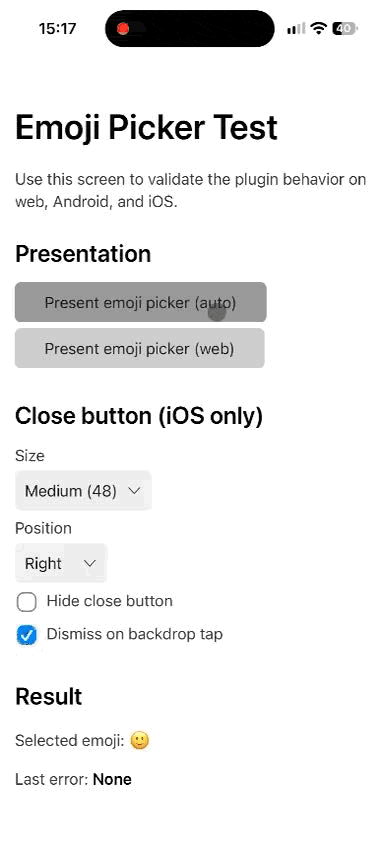
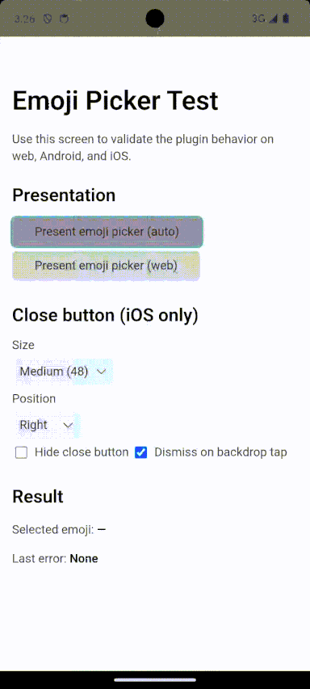
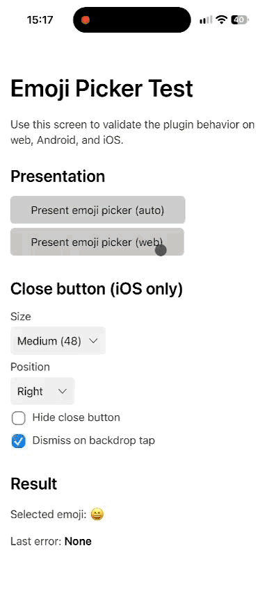

<p align="center">
  
</p>
<h3 align="center">Capacitor Emoji Picker for iOS, Android & Web</h3>
<p align="center"><strong><code>@independo/capacitor-emoji-picker</code></strong></p>
<p align="center">Emoji picker plugin for Capacitor 8 with native Android support, iOS system emoji keyboard integration, and a web fallback.</p>

<p align="center">
  
  <a href="https://www.npmjs.com/package/@independo/capacitor-emoji-picker"></a>
<br>
  <a href="https://www.npmjs.com/package/@independo/capacitor-emoji-picker"></a>
  <a href="https://www.npmjs.com/package/@independo/capacitor-emoji-picker"></a>
  <a href="https://codecov.io/gh/independo-gmbh/capacitor-emoji-picker/branch/main"></a>
</p>

<p align="center">Built and maintained by <a href="https://www.independo.app/">Independo</a>.</p>

## Overview

`@independo/capacitor-emoji-picker` is a Capacitor emoji picker plugin that brings a native emoji
picker to Android, a Capacitor emoji keyboard experience via the iOS system emoji keyboard, and a
web emoji picker fallback everywhere else — one API for Capacitor 8, Ionic, and any framework built
on top of it (Angular, React, Vue, or vanilla JS/TS).

Call `present()` and it resolves with the emoji the user selected: native/system UI first, with an
automatic fallback to the web picker when native presentation isn't available.

<table>
  <tr>
    <th align="center">iOS</th>
    <th align="center">Android</th>
    <th align="center">Web</th>
  </tr>
  <tr>
    <td align="center"></td>
    <td align="center"></td>
    <td align="center"></td>
  </tr>
</table>

## Installation

```
pnpm add @independo/capacitor-emoji-picker
pnpm exec cap sync
```

### Requirements

- Capacitor 8+
- iOS 15+
- Android minSdk 24+; builds require Java 21 (recommended). `pnpm verify:android` requires a Java version supported
  by the bundled Gradle wrapper (currently Java 21–24, with Java 21 recommended).

### Compatibility

Versioning follows Capacitor versioning. Major versions of the plugin are compatible with major versions of Capacitor.

| Plugin Version | Capacitor Version | Status |
|-----------------|--------------------|--------|
| 1.*             | 8                  | Active |

## Usage

```typescript
import { EmojiPicker } from '@independo/capacitor-emoji-picker';

const { emoji } = await EmojiPicker.present();
if (emoji !== null) {
    // user selected an emoji, e.g. insert it into a text field
    console.log(emoji);
} else {
    // user dismissed the picker without selecting one
}
```

Force the web picker instead of native/system UI:

```typescript
const { emoji } = await EmojiPicker.present({ presentation: 'web' });
```

Customize the close button (iOS/web only) and backdrop-tap dismissal:

```typescript
const { emoji } = await EmojiPicker.present({
    closeButton: { size: 'large', position: 'left' },
    dismissOnBackdropTap: false,
});
```

## Platform behavior

With the default `presentation: 'auto'`:

- **Android**: presents the AndroidX native picker (via
  [`androidx.emoji2:emoji2-emojipicker`](https://developer.android.com/jetpack/androidx/releases/emoji2)) first.
  If the native picker is unavailable or fails to present, falls back to the web picker rendered as a bottom sheet
  inside the app's own WebView.
- **iOS**: attempts a best-effort system emoji keyboard/input mode first. This relies in part on behavior Apple
  does not document or guarantee, so it may fall back to the web picker on some OS versions/configurations. The
  web picker is rendered as a bottom sheet inside the app's own WebView.
- **Web**: uses the web picker (via [`emoji-picker-element`](https://github.com/nolanlawson/emoji-picker-element))
  directly.

Passing `presentation: 'web'` bypasses native presentation entirely and always uses the web picker, on every
platform including Android and iOS.

Native-presentation failures fall back to the web picker automatically. User cancellation (dismissing the picker
without selecting an emoji) always resolves with `{ emoji: null }` and never triggers a fallback.

The web picker self-hosts its emoji dataset as a same-origin `blob:` object URL (rather than
fetching it from `emoji-picker-element`'s default CDN). Apps with a restrictive Content-Security-Policy
need to allow `blob:` in `connect-src`/`default-src` for this dataset to load.

Behavior that can't be reliably simulated in automated tests (especially the iOS system emoji keyboard) has a
manual QA checklist: see [`docs/MANUAL_QA.md`](./docs/MANUAL_QA.md).

## Troubleshooting

### Common error codes

The plugin rejects with error codes; check `error.code` (native) or `error.message` (web).

| Code                  | Platform(s)       | Typical cause                                                                 |
|------------------------|-------------------|--------------------------------------------------------------------------------|
| `ALREADY_PRESENTING`   | iOS, Android, Web | `present()` called while a picker is already active.                          |
| `NATIVE_UNAVAILABLE`   | iOS, Android      | The native picker UI could not be presented (e.g. no active Activity); triggers fallback to the web picker under `presentation: 'auto'`. |

---

## API

<docgen-index>

* [`present(...)`](#present)
* [Interfaces](#interfaces)
* [Type Aliases](#type-aliases)

</docgen-index>

<docgen-api>
<!--Update the source file JSDoc comments and rerun docgen to update the docs below-->

Interface for the EmojiPicker plugin, which presents a native or web emoji picker and
resolves with the emoji the user selected.

### present(...)

```typescript
present(options?: EmojiPickerOptions | undefined) => Promise<EmojiPickerResult>
```

Presents the emoji picker.

Resolves with `{ emoji: null }` rather than leaving the promise pending when the user
dismisses the picker without selecting an emoji.

Calling this method again while a picker is already active rejects immediately with the
`ALREADY_PRESENTING` error code rather than presenting a second, overlapping picker.

| Param         | Type                                                              | Description                       |
| ------------- | ----------------------------------------------------------------- | --------------------------------- |
| **`options`** | <code><a href="#emojipickeroptions">EmojiPickerOptions</a></code> | The options for the presentation. |

**Returns:** <code>Promise&lt;<a href="#emojipickerresult">EmojiPickerResult</a>&gt;</code>

--------------------


### Interfaces


#### EmojiPickerResult

Result of presenting the emoji picker.

| Prop        | Type                        | Description                                                                                                                        |
| ----------- | --------------------------- | ---------------------------------------------------------------------------------------------------------------------------------- |
| **`emoji`** | <code>string \| null</code> | The selected emoji as a complete Unicode string/grapheme (unchanged), or `null` when the picker was dismissed without a selection. |


#### EmojiPickerOptions

Options for presenting the emoji picker.

| Prop                       | Type                                                                                    | Description                                                                                                                                                                                                                                                                                                                 | Default             |
| -------------------------- | --------------------------------------------------------------------------------------- | --------------------------------------------------------------------------------------------------------------------------------------------------------------------------------------------------------------------------------------------------------------------------------------------------------------------------- | ------------------- |
| **`presentation`**         | <code><a href="#emojipickerpresentation">EmojiPickerPresentation</a></code>             | `auto`: prefer native/system UI and fall back to the web picker when native presentation is not available or fails. `web`: always use the web picker, including inside Capacitor native apps.                                                                                                                               | <code>'auto'</code> |
| **`closeButton`**          | <code><a href="#emojipickerclosebuttonoptions">EmojiPickerCloseButtonOptions</a></code> | Configures the close button rendered above the iOS keyboard/the web picker sheet (iOS has no system-provided one). Ignored on Android.                                                                                                                                                                                      |                     |
| **`dismissOnBackdropTap`** | <code>boolean</code>                                                                    | Dismiss the picker when the user taps the transparent area outside the keyboard/button (iOS) or the scrim outside the picker sheet (Android and web). On iOS and web, if `closeButton.hidden` is `true`, this is treated as `true` regardless of the value passed here, so the user always has a way to dismiss the picker. | <code>true</code>   |


#### EmojiPickerCloseButtonOptions

Configures the close button rendered above the iOS native emoji keyboard/the web picker sheet.

| Prop           | Type                                                    | Description                                                                                                                                        | Default               |
| -------------- | ------------------------------------------------------- | -------------------------------------------------------------------------------------------------------------------------------------------------- | --------------------- |
| **`size`**     | <code>'xSmall' \| 'small' \| 'medium' \| 'large'</code> | `xSmall`: 24pt, `small`: 32pt, `medium`: 48pt, `large`: 64pt.                                                                                      | <code>'medium'</code> |
| **`position`** | <code>'left' \| 'center' \| 'right'</code>              | Which side of the keyboard the button docks to.                                                                                                    | <code>'right'</code>  |
| **`hidden`**   | <code>boolean</code>                                    | Hides the built-in close button. See <a href="#emojipickeroptions">`EmojiPickerOptions.dismissOnBackdropTap`</a> for the safety net this triggers. | <code>false</code>    |


### Type Aliases


#### EmojiPickerPresentation

How the picker should be presented.

<code>'auto' | 'web'</code>

</docgen-api>

---

## License

`@independo/capacitor-emoji-picker` is MIT licensed (see [`LICENSE`](./LICENSE)) and maintained by [Independo GmbH](https://www.independo.app/).

Its web picker implementation depends on [`emoji-picker-element`](https://github.com/nolanlawson/emoji-picker-element) and [`emoji-picker-element-data`](https://github.com/nolanlawson/emoji-picker-element-data), both MIT licensed.